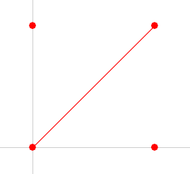

# **Get Started** - in under 10 minutes

## **(1) Modify The Zoomable Canvas (CDR)**

Zoomable canvas panes in Mini-App are found in the Chart folder.  CDR stands for "Chart Draw".

Open CDR_Example.cpp


You can see in DrawExample() were looping through Example->Points to draw the 4 red points on the screen.

Let's draw a diagonal line between the [0] point to the [2] point.


Just add the following code to add that line:

```cpp
    vec2 d1 =  ContentToGlobalSpace( { center.x + Example->Points[0].x, center.y - Example->Points[0].y } );
    vec2 d2 =  ContentToGlobalSpace( { center.x + Example->Points[2].x, center.y - Example->Points[2].y } );
    UIAddGlobalLine(d1.x, d1.y, d2.x, d2.y, 0xFF0000, 1);
```

Hit the play/compile button at the top of VSCode and you should see your change:



If you want to experiment with what other drawing tools are available - open [UILib.h](../UILib/UILib.h):


If you look at line 2148 and scroll down from there, you'll see there are hundreds of UILib functions you can use for drawing


## **(2) Modify A Property Page (PPG)**

Ok next, lets look at a simple example of modifying a property page.
First open the file [Test_PPG.cpp](../Blocks/PPG/Test_PPG.cpp)


Scroll down to the function: InitTestPPG
You can see all the UI Elements are being initialized there.
At the end of this function, add the following code to add some text:

```cpp
auto newText = form.AddText( "Hello From Mini-App" ); 
```

Hit the run button again and right click outside the dashed line.
Click on "Add Floating PPG" and you'll see the new text at the bottom of the property page.


