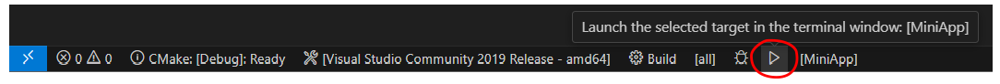
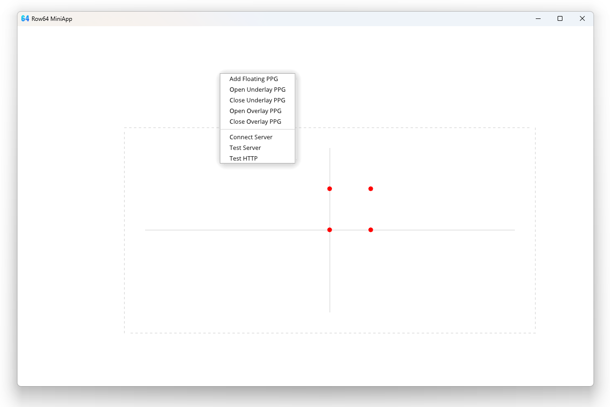

# **Install Notes for Windows**

## **(1) Set up Windows Dev Environment**

### Install the MSVC build tools.

The Row64 Mini-App compiles with MSVC 14.2 or newer. To get the compiler and build tools, install [Visual Studio Community](https://visualstudio.microsoft.com/vs/community/). This app has been tested with both the current version Visual Studio Community 2022 or the older version Visual Studio Community 2019.

You don't have to install the full Visual Studio Code development environment. Just install the **Desktop development with C++** tools.

Keep the default options on the right.

### Install Visual Studio Code and set up extensions.

[https://code.visualstudio.com/](https://code.visualstudio.com/)

These extensions are useful for building the project:

-----

## **(2) Install dependencies**

### Install boost

Boost needs to be built with the same compiler that you are using to build ExampleApp. Download the pre-built boost binaries for MSVC compilers here: https://sourceforge.net/projects/boost/files/boost-binaries/1.70.0/

Look for the binary that matches MSVC Version 14.2.

Verify that the `BOOST_ROOT` path in [CMakeLists.txt](../CMakeLists.txt) is the same as where you installed boost. If you installed boost in a custom location, update the path to the location where you installed boost.

-----

## **(3) Open the project in Visual Studio Code**

### The first time you run Visual Studio Code on a C++ project, you may need to do some setup.

If you have installed the CMake Tools extension, you should see a blue bar at the bottom:

Click on `No Kit Selected`, and it should pop up a menu on the screen that lets you choose a compiler. Since we've installed the MSVC build tools, we will use `amd64` compiler.

If there are no kits found, run CMake Tool's `Scan for Kits` command. To open the command palette in VS Code, press   `⌘ + SHIFT + P`.

Once the kit has been found, the bottom blue bar should indicate it has found it.

### You will also need to specify the path to CMake to the CMake Tools settings file in Visual Studio Code.

To get the path for CMake, open the **Developer Command Prompt for Visual Studio**. This can be found in the Start Menu folder for Visual Studio:

In the prompt, run the command, `where cmake`, and it should print out the path. Copy the path.

Then, in Visual Studio Code open the CMake Tools settings file. You can do this by navigating to the **Extensions** pane in the side bar and clicking the gear icon under CMake Tools. It will pop up a context menu. Select **Configure Extension Settings**.

This opens up a UI to set settings for CMake Tools. Scroll down until you see **Cmake: Cmake Path**. Paste the path you copied into the text input box, then close the file.

-----

## **(4) Setup the Ninja Generator**

 
In VSCode flip to the extension settings and click on the little gear on the right of "CMake Tools".
  
Then click on "Extension Settings"
  

 
Next set the "Cmake:Generator" to "Ninja".  Case is important - only capitalize the first letter.  
Also set the "Cmake: Parallel Jobs" to 8
  

-----

## **(5) Compile the project**

### Press `Build` to compile the project. 

You may see some warning during the compile process. As long as the executable builds, you can ignore the warnings.

You can also build and run by hitting the play button:

### Open the ExampleApp executable and you should see:

 
Use the mouse wheel to zoom in and out.  You can right click drag to move the canvas around:
  

 
When you zoom out, you'll notice there's a dashed line around the canvas.  If you right click outside the dashed line there's a right click popup:
  

If you click on "Add Floating PPG" you'll see a popup will appear.
  

 
We'll explain more details on editing the PPG and the zoomable canvas in the Getting Started section.
 

### Click here to [Get Started!](Get_Started.md)

-----
