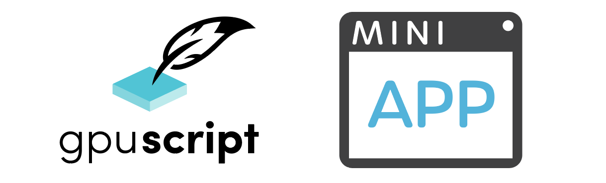

 

 

## Row64 Mini-App with GPU-Script
The light speed drawing API to customize and extend the Row64 Platform

Mini-App is a lightweight application template where you can mockup: widgets,
user interfaces, dashboard panes or even applications to ingest data.

The goal is to create professional & fast user interfaces to connect to Row64 or prototype custom behavior.

The current version of Mini-App is Windows based.  For the sake of quick setup it uses DirectX11.  This same code will easily map into more modern and faster graphics APIs (ex: Vulkan) and other operating systems (ex: Linux) through the Row64 Platform.

### Features for Mini-App & GPU-Script:
  * Graphics & UI
    * Property Pages (aka PPGs)
      * Movable pop up panes that automatically resize and add scroll bars
      * Easy to use, but also extremely powerful to customize
      * Syntax similar to css Flexbox
    * Global Layout Of Panes (aligned with layout in Row64 Dashboards)	
    * Dynamic canvas layouts with Pan & Zoom (aka CLO/CDR)
    * UI Library: High End Design Quality & High Speed
       * All UI Interaction rapidly pushed to the GPU triangle submission
       * Text Input, Manipulation and Formatting
       * Large number of drawing primitives and features
  * File IO & Networking
    * Bytestream - lightning speed file format for storage and communication
    * Websockets and HTTP Client to connect to the Row64 Platform
    * Javascript style (in C++) async callbacks
    * High speed memory mapped files
    
### Use Cases
  1. Stand alone apps that move data into Row64
  2. Rapid protypying of UI Elements for the Row64 Platform
  3. Small Apps within the R64 Recipes System
  4. Training for the C++ API in Row64.

## **Documentation**

* [Install Guide](Doc/Install_Notes.md)
* [Get Started](Doc/Get_Started.md)
* [MIT License](LICENSE.txt)

  
